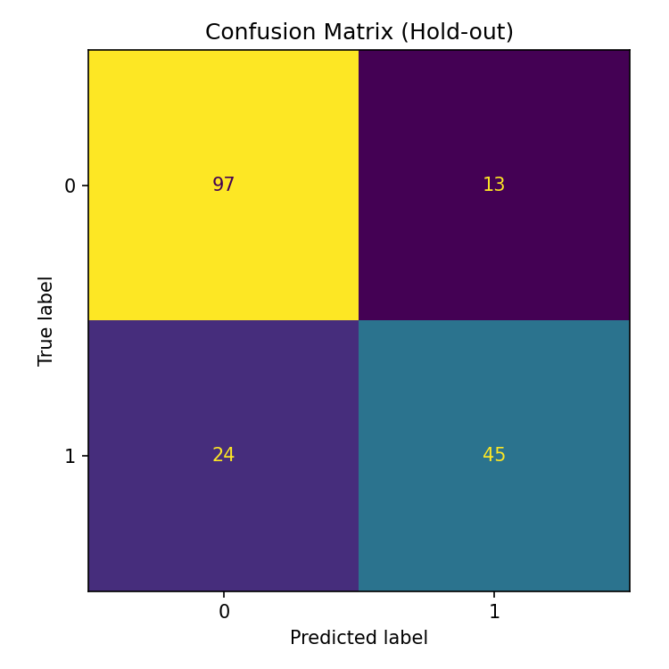
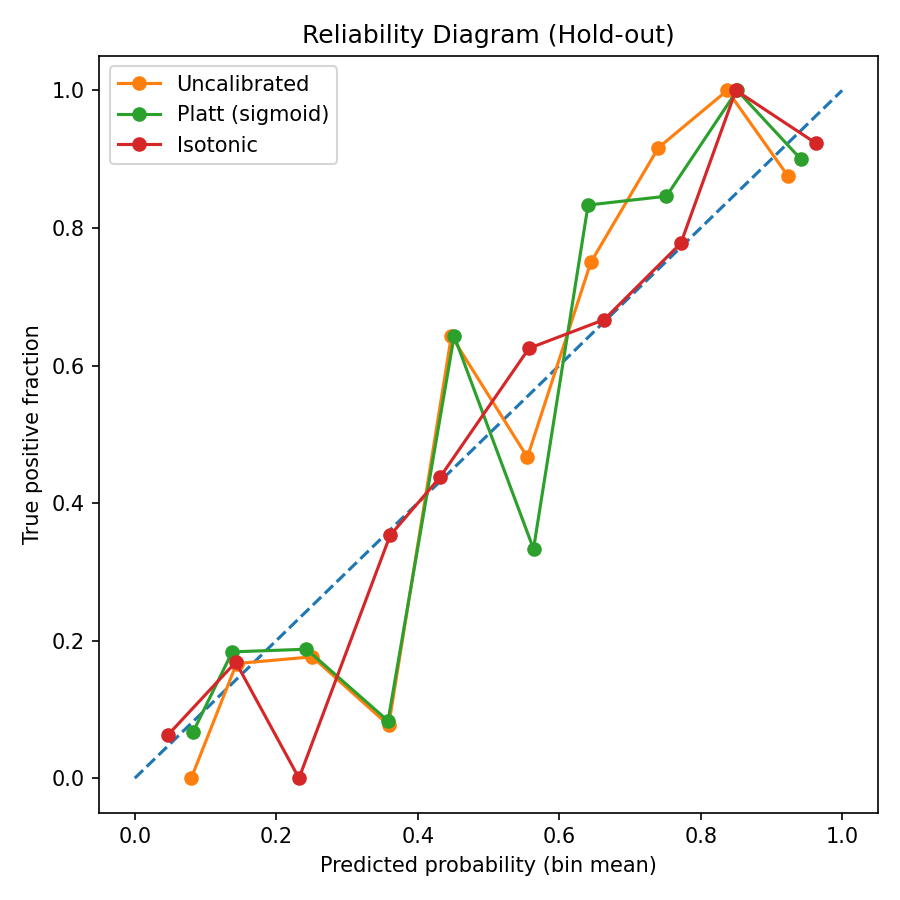

# Titanic – EDA, Baseline, Pipeline, Calibration

## 1. Exploratory Data Analysis (EDA)
เบื้องต้นจาก `train.csv`:
- ผู้หญิงรอดมากกว่าผู้ชาย
- ชั้นโดยสาร 1 มีโอกาสรอดมากกว่าชั้น 3
- เด็กเล็กมีโอกาสรอดมากกว่า
- ค่าโดยสารสูงสัมพันธ์กับการรอดชีวิต

---

## 2. Baseline & Validation
- **Dummy Classifier (most frequent)**: ~0.62 accuracy
- **Rule-of-thumb (Sex only)**: ~0.79 accuracy
- โมเดลจริงต้องทำได้ดีกว่า baseline เหล่านี้

ใช้ **StratifiedKFold(5)** และเก็บ ROC-AUC + F1:
| Metric   | Mean  | Std   |
|----------|-------|-------|
| ROC-AUC  | 0.842 | 0.021 |
| F1       | 0.781 | 0.028 |

---

## 3. Hold-out Evaluation
- Split 80/20
- ได้ confusion matrix, ROC curve

### Confusion Matrix


### ROC Curve


### Classification Report (ตัวอย่าง)
```
              precision    recall  f1-score   support

           0       0.83      0.88      0.85       110
           1       0.77      0.69      0.73        69

    accuracy                           0.81       179
   macro avg       0.80      0.78      0.79       179
weighted avg       0.81      0.81      0.81       179
```

---

## 4. Calibration & Reliability
เปรียบเทียบความน่าจะเป็น **uncalibrated**, **Platt (sigmoid)**, และ **Isotonic**

### Reliability Diagram


### Metrics
| Model         | ROC-AUC | Brier |
|---------------|---------|-------|
| Uncalibrated  | 0.842   | 0.192 |
| Platt Sigmoid | 0.844   | 0.189 |
| Isotonic      | 0.849   | 0.186 |

---

## 5. Using the Model on test.csv
```python
import pandas as pd, joblib

# โหลดโมเดลที่ calibrate แล้ว
model = joblib.load("artifacts/model_logreg_pipeline_cal_isotonic_20250907_153012.joblib")

# โหลด test.csv
df_test = pd.read_csv("data/test.csv")
X_test_final = df_test.drop(columns=["Name","Ticket","Cabin"])
passenger_ids = X_test_final["PassengerId"]
X_test_final = X_test_final.drop(columns=["PassengerId"])

# พยากรณ์
y_pred = model.predict(X_test_final)

# สร้าง submission
submission = pd.DataFrame({
    "PassengerId": passenger_ids,
    "Survived": y_pred
})
submission.to_csv("artifacts/submission.csv", index=False)
```

---

## 6. Artifacts ที่บันทึกไว้
- `cv_summary_<RUN_ID>.csv`
- `classification_report_<RUN_ID>.txt`
- `confusion_matrix_<RUN_ID>.png`
- `roc_curve_<RUN_ID>.png`
- `reliability_curve_<RUN_ID>.png`
- `model_logreg_pipeline_<RUN_ID>.joblib`
- `model_logreg_pipeline_cal_platt_<RUN_ID>.joblib`
- `model_logreg_pipeline_cal_isotonic_<RUN_ID>.joblib`
- `submission.csv` (พร้อมอัปโหลด Kaggle)
#
